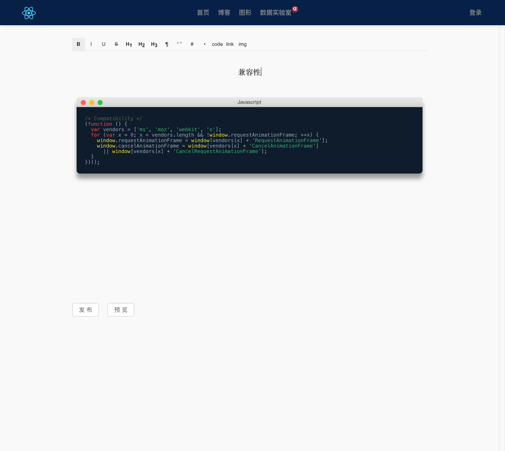
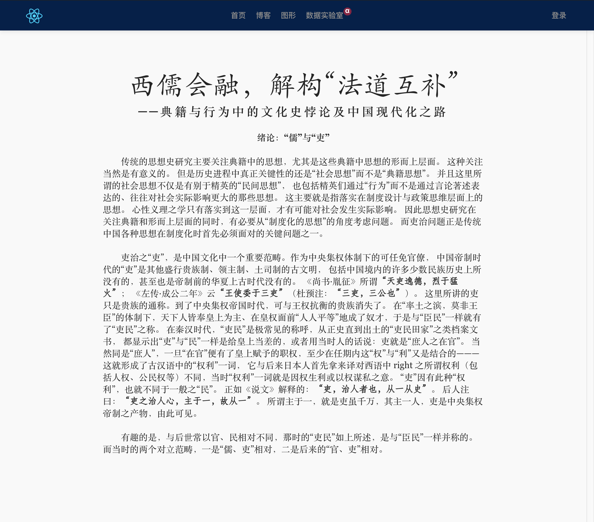
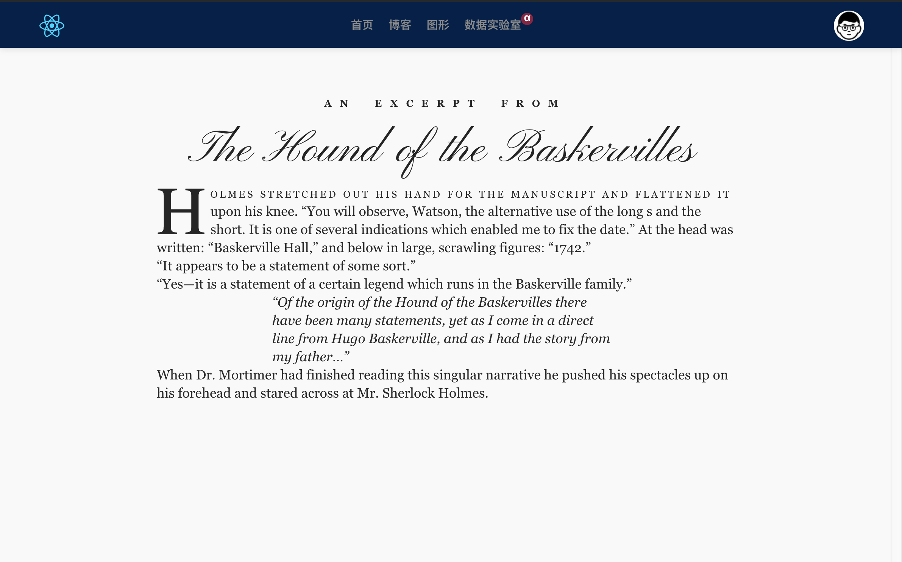

# blog_server
Golang server (base Gin & React )

## Sample


### 编辑器
---

### 中文排版
---

### 英文排版
---


```bash
# get
curl -X GET  "http://127.0.0.1:8000/api/v1/tag"
# post
curl -X POST -H "Content-Type: application/json" "http://127.0.0.1:8000/api/v1/user" -d '{"username":"ped","password": "123456"}'
# put
curl -X PUT -H "Content-Type: application/json"  "http://127.0.0.1:8000/api/v1/tag/1" -d '{"username":"ped","password": "123456"}'
# delete
curl -X DELETE  "http://127.0.0.1:8000/api/v1/tag/1"

```


